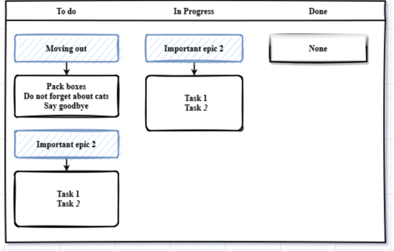

# Task-Manager project.

Программа, отвечает за формирование модели данных следующего типа:

- трекер задач, позволяющий эффективно организовать совместную работу над задачами.

Задачи делится на:
+ Простые задачи
+ Составные задачи (эпики)
+ Подзадачи (сабтаски для эпиков)

Приложение написано на Java, без применения фреймворков.

